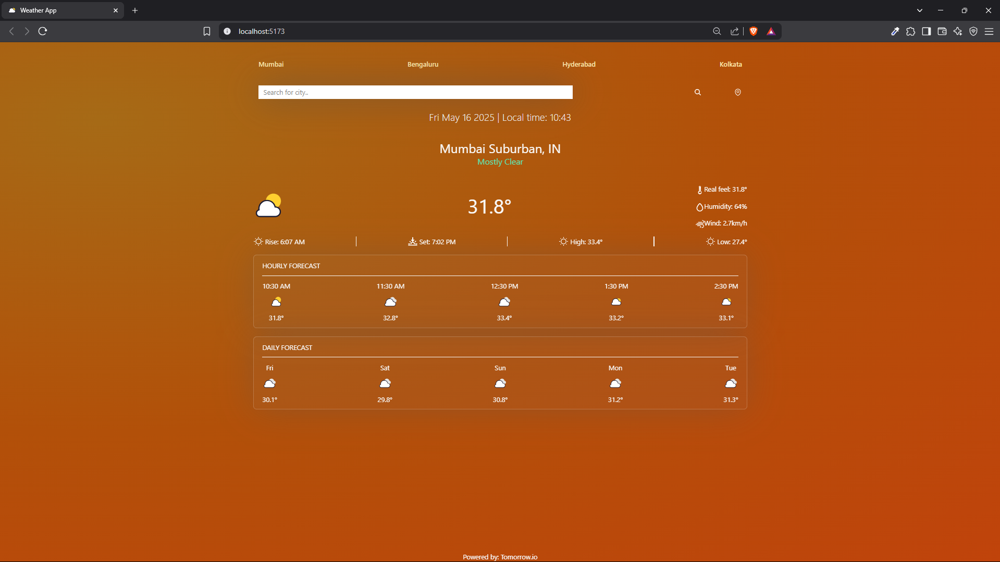
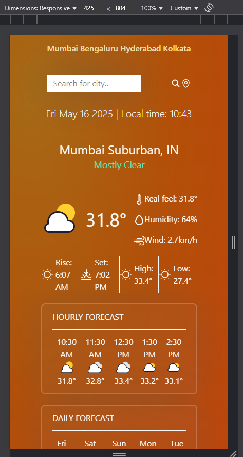
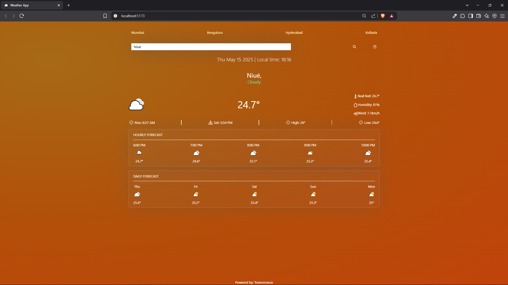
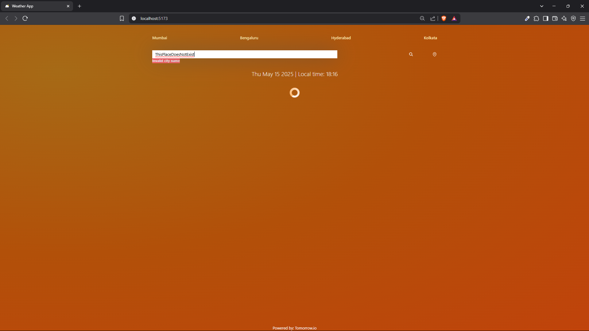

# Weather App
This is a weather built with the intention of building a clean UI. It uses glassmorphism along with subtle gradients to create an aesthetic feel for the website. The project includes a backend as well. It makes API calls when the frontend requests for weather data, in order to return the real time weather data, along with daily and hourly weather forecast. This prevents API key from being exposed to the frontend.

# Features
- Gives real time weather of any location in the world.
- Gives hourly weather forecasts for any location in the world.
- Gives daily weather forecasts for any location in the world.
- Displays current date and time for any location in the world. [Using Luxon]

## Tech Stack
- **Fronted**: React, Tailwindcss, Vite
- **Backend**: Node, Express

## Project Images
**_Home Page_**

**_Home Page on mobile_**

**_Search Function_**

**_Error handling_**
